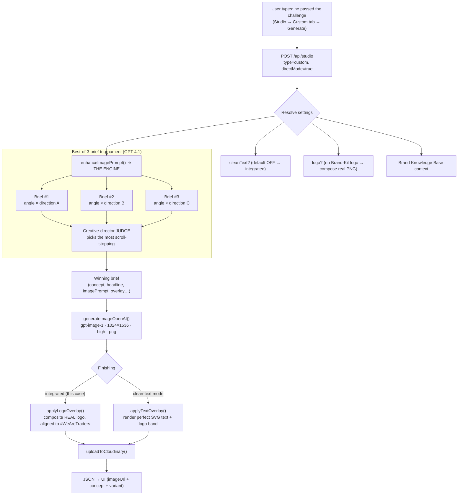

# How a Creative Is Generated — Reverse-Engineering `he passed the challenge`

This document traces, end-to-end, exactly what the Creative Studio does when a user types a
short prompt like **`he passed the challenge`** and hits Generate. It is a faithful map of the
real code paths (not a generic description), so you can reason about, debug, and tune the engine.

> **One-line summary:** a 4-word prompt is expanded by a **best-of-3 "brilliant" tournament**
> (3 diverse briefs written by GPT‑4.1, judged by a GPT‑4.1 creative director), the winning brief
> is rendered by **gpt-image-1**, and the **real Hola Prime logo is composited** on top — then the
> result is uploaded to Cloudinary and returned to the UI.

---

## The pipeline at a glance



**Files involved (the whole journey):**

| Stage | File · function |
|---|---|
| 1. Routing | `app/api/studio/route.ts` (the `type==='custom' && directMode` block) |
| 2. Settings | `app/api/studio/route.ts` + `server/ai-studio/brand-knowledge.ts` (`getBrandLogo`, `buildBrandKnowledgeContext`) |
| 3. The engine | `server/ai-studio/prompt-enhancer.ts` (`enhanceImagePrompt`, `generateBrief`, `judgeBriefs`) |
| 4. Image synthesis | `server/ai-studio/imagegen-openai.ts` (`generateImageOpenAI`) |
| 5. Finishing | `server/ai-studio/logo-overlay.ts` (`applyLogoOverlay`) / `server/ai-studio/text-overlay.ts` (`applyTextOverlay`) |
| 6. Store + return | `app/api/studio/route.ts` (`uploadToCloudinary`, `NextResponse.json`) |

---

## Stage 1 — Request hits the route

The Studio **Custom tab** sends a `POST /api/studio` with roughly:

```json
{ "prompt": "he passed the challenge", "type": "custom", "directMode": true,
  "cleanText": false, "useLogo": false }
```

`route.ts` matches `type === 'custom'` and, because `directMode === true`, enters the
**Enhanced Fast Mode** path (a single fast generation, **not** the slower 3-variant pipeline).
It trims the prompt and checks that `OPENAI_API_KEY` exists.

---

## Stage 2 — Resolve settings (3 decisions)

| Decision | Code | For `he passed the challenge` |
|---|---|---|
| **Text mode** | `cleanText = body.cleanText ?? STUDIO_CLEAN_TEXT_DEFAULT==='on'` | `false` → **integrated** (the image model renders the text) |
| **Logo** | `wantsLogo = body.useLogo===true`; `logoWillBeComposited = wantsLogo && hasBrandLogo` | `false` (no uploaded Brand-Kit logo) → we'll composite the **bundled real PNG** instead |
| **Brand context** | `buildBrandKnowledgeContext()` | Pulls voice/offers/colours/CTA/disclaimer from Settings → Brand Kit (falls back to the built-in Hola Prime brand block if nothing is uploaded) |

These three flags decide which branches fire later. With the defaults above, the path is:
**integrated text + composite the authentic logo**.

---

## Stage 3 — ⭐ The engine: best-of-3 brief tournament

This is what turns 4 words into an agency-grade brief. `enhanceImagePrompt()` does **not** make a
single call — it runs a **tournament** (controlled by `STUDIO_BEST_OF`, default **3**):

1. **Pick diversity.** From a pool of **22 creative directions** (`CREATIVE_DIRECTIONS` — receipt,
   Bloomberg terminal, lock-screen notification, leaked Discord chat, vault, challenge coin,
   equity-curve sunrise, etc.) it picks **3 distinct** ones, and from **5 angles**
   (`BRILLIANT_ANGLES` — Emotional/Human, Proof/Receipt, Bold Art-Direction, Story/Tension,
   Persuasion-Made-Physical) it picks **3 distinct** ones. Each candidate = one *(angle × direction)*
   pair. **This is why every generation looks different.**

2. **Write 3 briefs in parallel.** For each pair, `buildUserMessage()` assembles
   `SYSTEM_PROMPT` (the "world-class direct-response creative director" with its HARD RULES) +
   the assigned angle + the assigned direction + the brand block, and calls the LLM. The model
   used is **GPT‑4.1** by default (`OPENAI_PRIMARY`), with a fallback cascade
   `[gpt-4.1 → claude-opus-4-8 → claude-sonnet-4-6 → claude-haiku-4-5]`.

   Each brief is returned as strict JSON:
   ```
   { concept, hook, headline, cta, imagePrompt (350–700 words, text integrated),
     visualPrompt (120–250 words, TEXT-FREE plate), overlay { headline, subheadline,
     price, bullets[], cta, urgencyText, promoCode, disclaimer } }
   ```

3. **Repair + validate.** `fixupBrief()` force-corrects the brand CTA (`Buy Challenge`), the
   `#WeAreTraders` tagline, and the legal disclaimer; `validateBrief()` checks the brief is rich
   enough and that **every number/word from the user prompt is preserved**.

4. **Judge.** `judgeBriefs()` shows all 3 concepts to a **GPT‑4.1 creative-director judge**
   (temperature 0.2) prompted to pick the single most scroll-stopping, original, emotionally
   sharp idea — and to *penalise* generic info-cards. It returns `{ winner, why }`.

**Concrete result for this prompt:** in testing, `he passed the challenge` produced winners like
**"Leaked Discord Pass Announcement"** (headline *"Bro… he actually passed."*) and
**"The Withdrawal Moment"** — different design language each run, exactly as intended.

> `directionHint` (used for QA/testing) short-circuits the tournament: it forces ONE brief with a
> chosen direction and skips the judge.

---

## Stage 4 — Image synthesis (gpt-image-1)

For the integrated path, `genPrompt = enhanced.imagePrompt` (the winning brief's full,
text-integrated prompt). The route calls **`generateImageOpenAI`** directly:

```
generateImageOpenAI({ prompt: genPrompt, size: '1024x1536', quality: 'high', output_format: 'png' })
```

- Model: **gpt-image-1**, portrait `1024×1536` (closest to a 9:16 ad), high quality, lossless PNG.
- This path renders **all the text into the image itself** (headline, bullets, price, CTA, disclaimer).

> **Note:** `directMode` bypasses the multi-provider `generateImage()` orchestrator in
> `imagegen.ts`. That orchestrator (a 3-tier fallback **OpenAI → Ideogram V_3 → Gemini/Imagen**,
> plus prompt sanitization) is used by the *other* generation paths (reference edits, top-ads,
> the 3-variant pipeline) — not by this fast direct path.

---

## Stage 5 — Finishing: two modes

### A) Integrated mode (what `he passed the challenge` uses)
The model already drew the text, so the only finishing step is the **logo**. Because there's no
uploaded Brand-Kit logo, `applyLogoOverlay()` composites the **bundled authentic PNG**
(`public/holaprime-logo.png`). The recent fix makes this clean:

1. **Remove the black background** (near-black pixels → transparent).
2. **`.trim()`** the transparent padding so the wordmark hugs the corner.
3. **Fit into a band** — `logoMaxH = height*0.085`, `logoMaxW = width*0.30` (the stacked 2-line mark).
4. **Vertically center on the brand line** — `brandLineCenterY = height*0.06`, `paddingLeft = width*0.055`,
   so the logo lands top-left **on the same horizontal line as the `#WeAreTraders` pill**.

This is also why we **tell the image model NOT to draw a logo** and to **reserve a clean top ~10–12%
brand strip with the headline starting below it** (`prompt-enhancer.ts` branding rules). Letting the
model draw the wordmark caused the earlier overlap-with-headline bug and risked typos — compositing
the real PNG is crisp and correct every time.

### B) Clean-text mode (`cleanText: true`)
A different, zero-typo strategy: the model renders a **text-free visual plate** (dark, full-bleed),
then `applyTextOverlay()` composites **perfectly-spelled SVG text** (headline, price, bullets, CTA,
disclaimer) plus a brand band (logo top-left + `#WeAreTraders` top-right). Use this when text
fidelity matters more than fully-integrated art direction.

---

## Stage 6 — Store & return

`uploadToCloudinary()` pushes the finished PNG to `creative-studio/fast` and swaps in the short
hosted URL (so history/DB stay tiny; falls back to the data URI if Cloudinary is unconfigured).
The route returns JSON: the `creative` object with `imageUrl`, the `concept` title, the
`headline`/`cta`, and a single enhanced `variant`.

---

## The knobs (how to tune behavior)

| Knob | Where | Effect |
|---|---|---|
| `STUDIO_BEST_OF` | env (default `3`) | How many diverse briefs compete in the tournament (clamped 1–4). `1` = no tournament. |
| `STUDIO_ENHANCER_OPENAI_MODEL` | env (default `gpt-4.1`) | Which LLM writes/judges the briefs. |
| `STUDIO_ENHANCER_PROVIDER` | env (`openai`/`anthropic`) | Which provider leads the fallback cascade. |
| `STUDIO_CLEAN_TEXT_DEFAULT` | env (`on`/off) | Default text mode when the UI doesn't send `cleanText`. |
| `cleanText` | request body | Integrated render (false) vs zero-typo SVG overlay (true). |
| `useLogo` + Brand Kit | request body / Settings | Composite an **uploaded** logo (auto-contrast) vs the bundled PNG. |
| `directionHint` | request body | Force one specific creative direction (skips the tournament + judge). QA only. |
| `TEXT_OVERLAY` | env | Global on/off for the clean-text compositor path. |

---

## Why diversity "just happens" (the SaaS goal)
You don't toggle anything. Every generation independently shuffles **22 directions × 5 angles**,
writes **3 competing briefs**, and a judge picks the boldest — so the same 4 words yield a vault one
run, a leaked-chat the next, an emotional close-up the next. Short prompts give the engine the most
room to flex; specific facts (prices, %, codes) are preserved verbatim through `validateBrief`.
