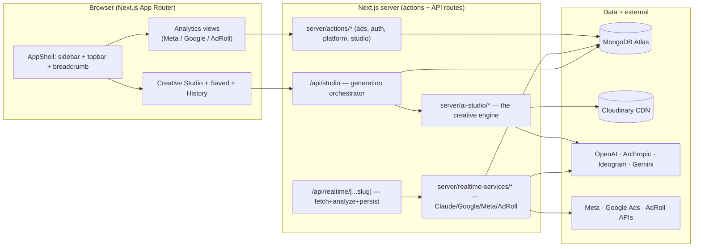

# Hola Prime Creative Analyzer — Project Context

The canonical "what is this whole thing" document. It maps every subsystem so a new engineer
(or a fresh AI session) can get productive fast. For the generation pipeline specifically, see
the companion **[HOW_GENERATION_WORKS.md](HOW_GENERATION_WORKS.md)**.

---

## 1. What it is

A **prop-firm ad intelligence + creative-generation platform** for **Hola Prime** (a proprietary
trading firm). It has two halves under one Next.js app:

1. **Analytics Dashboard ("YOUR ADS")** — ingests the firm's live ad data from **Meta, Google Ads,
   and AdRoll** into MongoDB, then shows KPIs, campaigns, creatives, and **AI creative analysis**
   (a 5‑lens × 5‑funnel diagnosis powered by Claude) per ad.
2. **AI Creative Studio** — turns a short prompt (e.g. `he passed the challenge`) into a finished,
   on-brand ad creative using a best-of-N brief tournament + gpt-image-1, with brand-kit logo
   compositing, scoring, history, and refinement.

Internal tool, gated to `@holaprime.com` users. Being shaped into a **SaaS** (prompt-driven, no
manual toggles — the engine decides).

---

## 2. Tech stack

| Layer | Choice |
|---|---|
| Framework | **Next.js 16.0.10** (App Router, Turbopack), **React 19.2**, TypeScript 5 |
| Auth | **NextAuth v5** (beta) — Credentials (bcrypt) + Google OAuth, MongoDB adapter, JWT sessions |
| Data | **MongoDB 7** (Atlas) + **Mongoose 9**; DB name `MONGODB_DB` (default `reddit_data`) |
| AI — text/briefs | **OpenAI** `gpt-4.1` (primary) + **Anthropic** `claude-sonnet-4-6` / `opus` / `haiku` fallbacks |
| AI — images | **OpenAI gpt-image-1** (primary) → **Ideogram V_3** → **Google Gemini/Imagen** (fallback chain) |
| AI — analysis | **Anthropic Claude** (vision) — creative scoring + the 5‑lens × 5‑funnel diagnosis |
| Image ops | **Sharp** (logo/text compositing), **Cloudinary** (CDN storage) |
| Ad platforms | Meta Graph API v24.0 (+ Ad Library), Google Ads API (GAQL, v23), AdRoll API v1 |
| UI | **Radix UI + shadcn/ui** (New York style), **Tailwind CSS 4.1**, `next-themes` (dark-first), Recharts, Sonner |
| Email | Nodemailer (Gmail SMTP) — OTP verification + password reset |
| Deploy | Standalone output, **Dockerfile** (Node 20 Alpine, multi-stage), port 3000 |

---

## 3. Architecture at a glance



---

## 4. Repo layout

```
New_creative_analyzer/
├─ app/
│  ├─ (dashboard)/            # protected route group (AppShell + providers)
│  │  ├─ page.tsx             # /overview home (platform/account/search router)
│  │  ├─ overview/meta|google # per-platform analytics views
│  │  ├─ studio/              # AI Creative Studio
│  │  ├─ saved/  legacy/      # saved creatives · legacy ad search
│  │  └─ settings/  profile/  # account pages
│  ├─ api/
│  │  ├─ studio/route.ts      # ⭐ generation orchestrator
│  │  ├─ realtime/[...slug]/  # fetch + analyze + persist ad data
│  │  ├─ adlibrary/  brand-knowledge/  history-image/  history-lite/  auth/
│  ├─ login/ verify/ reset-password/   # public auth pages
├─ server/
│  ├─ actions/                # ads.ts, auth-actions.ts, platform-actions.ts, studio-actions.ts
│  ├─ ai-studio/              # ⭐ the creative engine (30+ modules — see §7)
│  ├─ realtime-services/      # Claude analyzer, Google/Meta/AdRoll clients, persistence
│  ├─ auth.ts / auth.config.ts / mail.ts / mongodb-client.ts / image-cache.ts
├─ components/                # 41 domain components + ui/ (shadcn) + shell/ + providers/ + overview/
├─ lib/                       # types.ts (the 175-field AdData), utils
├─ hooks/  public/  scripts/  middleware.ts  next.config.mjs  Dockerfile
├─ HOW_GENERATION_WORKS.md    # deep dive on the generation pipeline
└─ PROJECT_CONTEXT.md         # this file
```

---

## 5. Auth, routing & shell

- **Route protection:** `middleware.ts` (Edge) checks the NextAuth session cookie; everything under
  `/(dashboard)` requires auth. Public: `/login`, `/verify`, `/reset-password`, `/api/auth`, assets.
- **Providers:** Credentials (email+password, bcrypt) **and** Google OAuth — the `signIn` callback
  **hard-gates to `@holaprime.com`**. Sessions are **JWT, ~12‑min maxAge** with `updateAge:0` (refresh
  on every check) — there's a `session-timeout` component watching inactivity.
- **Registration/reset:** 6‑digit **OTP + magic link** by email (Nodemailer/Gmail; in dev with no
  `GMAIL_*` it logs the OTP to console). Tokens live in `verification_tokens` (10‑min expiry).
- **Shell:** `components/shell/app-shell.tsx` — desktop collapsible sidebar (state in localStorage),
  mobile off-canvas Sheet, topbar with universal data-driven breadcrumb, content-zoom (0.7–1.4×).
- **Providers stack** (dashboard layout): `UiSettingsProvider` → `PlatformsProvider` → `AppShell`.

---

## 6. Analytics Dashboard — "YOUR ADS" data layer

- **Source of truth:** MongoDB collections — `creative_data` (Meta), `google_data` /
  `google_asset_data` (Google), `adroll_data` (AdRoll), `app_config` (enabled platforms).
- **Server-side performance** (the speed work): `server/actions/ads.ts`
  - **`fetchMetaAdsPage`** — server-paginated grid (filter + skip/limit/count, newest first). Uses a
    **light projection** (~1KB scalar fields/doc) so it never reads the heavy analysis prose for list views.
  - **`fetchMetaOverview`** — one **`$facet` aggregation** computing KPIs, top campaigns, formats, and a
    14‑day daily series in a single round-trip (numeric `$convert` guards string/null fields).
  - **`fetchMetaFacets`** — cheap per-account counts (powers account-switcher badges + breadcrumb totals).
  - **`fetchAdDetailById`** — **no projection**; reads the full ~175-field doc only when a detail panel opens.
- **Dual-mode UI:** `components/platform-view.tsx` is the shared wireframe (6 KPI cards + Overview/
  Campaigns/Ads tabs). If `fetchOverview`/`fetchAdsPage` props are passed (Meta/Google) it runs
  **server-mode**; otherwise it filters/paginates **in-memory** (AdRoll). Tab/page/scroll persist in
  `sessionStorage`.
- **HD creatives:** `thumbnailUrl` resolved during sync via Meta permalinks (no Cloudinary, free).
- **Ad detail panel** (`meta-ad-detail-view.tsx`): Brief (5‑lens × 5‑funnel), Performance (metrics grid),
  Design Footprint, Creative Intelligence, AI Insights (strengths/risks/recs), copy Variants — plus
  **analyze-on-click** (re-runs Claude analysis in real time).

---

## 7. Creative Studio + AI engine  ⭐

Full trace in **[HOW_GENERATION_WORKS.md](HOW_GENERATION_WORKS.md)**. Summary:

- **Entry:** `app/api/studio/route.ts` routes `type = custom | pattern-based | top-ads`.
- **The brilliant engine** (`server/ai-studio/prompt-enhancer.ts`): a **best-of-3 tournament** —
  `STUDIO_BEST_OF` (default 3) briefs written by **gpt-4.1**, each locked to a distinct
  *(angle × direction)* from **5 angles × 22 creative directions**, then a **gpt-4.1 creative-director
  judge** picks the most scroll-stopping. This is the source of diversity.
- **Image synthesis:** `imagegen-openai.ts` (gpt-image-1, 1024×1536, high, png) for the fast direct
  path; `imagegen.ts` is a **3-tier provider fallback** (OpenAI → Ideogram → Gemini/Imagen) used by the
  pattern/top-ads pipelines.
- **Two finishing modes:**
  - **Integrated** (default) — model renders the text; **`logo-overlay.ts`** composites the real
    `public/holaprime-logo.png` (black-bg removed, `.trim()`ed, fit into a band, vertically centered
    on the `#WeAreTraders` line). *This is the recently-fixed logo path.*
  - **Clean-text** (`cleanText:true`) — model renders a text-free plate; **`text-overlay.ts`**
    composites perfectly-spelled SVG text + brand band (zero typos).
- **Supporting modules:** `director.ts` (3 concept-diverse paradigms), `scorer.ts` (Claude-Vision
  12-dimension quality score, ≥8 = pro), `agent.ts` (plan→generate→score→self-correct), `refine.ts`
  (feedback → revised prompt), `personas.ts`, `templates.ts`, `patterns.ts`, `memory.ts`
  (learn from past winners), `storage.ts` (Cloudinary), `brand-knowledge.ts` (Brand Kit).
- **UI:** `creative-studio-view.tsx` (tabs, form, variant carousel, like/dislike), plus
  `creative-history-view.tsx` and `saved-creatives-view.tsx`.

---

## 8. Realtime analysis services & integrations

`server/realtime-services/*` (orchestrated by `app/api/realtime/[...slug]/route.ts`):

- **`claudeAnalyzer.js`** — the **5‑LENS × 5‑FUNNEL** framework: 5 lenses (consumer psychology,
  behavioral economics, ad principles, neuromarketing, behavioral psychology) × 5 funnel stages
  (hook / hold / CTR / CVR / fatigue). Mode A = visual-only prediction; Mode B = visual × metrics diagnosis.
- **`googleAdsService.js`** — Google Ads GAQL client; fetches 7 ad types (RSA, Display, DemandGen,
  Video, PMAX…), flattens to asset-level metrics; **`assetAnalyzer.js`** scores individual assets.
- **`metaInsightsEnrich.ts`** — Meta Insights API v24.0; pulls Stage 1‑4 KPIs (thumb-stop ratio, video
  retention curves, outbound clicks, CVR/CPA) and writes them onto `creative_data`.
- **`saveMetaAnalysis.ts`** — upserts analyzer output with `updateMany` (handles duplicate adId docs).
- **Ad Library** (`server/ai-studio/adlibrary.ts`, `ad-library-*.ts`, `competitor.ts`) — fetches
  Hola Prime + **competitor** ads for brand-DNA / winning-pattern extraction (note: raw Ad Library
  token can hit permission code 10; the MCP `ads_library_search` is the reliable route).
- **`crossplatform.ts`** — platform-specific specs (Meta Feed/Story, TikTok, Google Display, LinkedIn…).

---

## 9. Data model (MongoDB collections)

| Collection | Holds |
|---|---|
| `creative_data` | Meta ads + full AI analysis (the 175-field `AdData`, `lib/types.ts`) |
| `google_data` / `google_asset_data` | Google ad- and asset-level analysis |
| `adroll_data` | AdRoll retargeting ads/metrics |
| `app_config` | Enabled platforms (admin toggles) |
| `ad_library` | Fetched Hola Prime + competitor ads (pattern extraction) |
| `users`, `verification_tokens`, `sessions` | Auth |
| `brand_knowledge` | Brand Kit (uploaded logo + voice/offers docs) |
| `creative_generations`, `prompt_templates`, `user_preferences` | Studio memory, templates, feedback |

> Default DB name is `reddit_data` (legacy — set via `MONGODB_DB`).

---

## 10. Environment variables

```
# Core
MONGODB_URI=                 MONGODB_DB=reddit_data
AUTH_SECRET=                 AUTH_URL=

# Auth / email
GOOGLE_CLIENT_ID=            GOOGLE_CLIENT_SECRET=
GMAIL_USER=                  GMAIL_APP_PASSWORD=

# AI providers
OPENAI_API_KEY=              ANTHROPIC_API_KEY=
IDEOGRAM_API_KEY=            GEMINI_API_KEY=

# Ad platforms
META_ACCESS_TOKEN=           (System-User token; v24.0)
GOOGLE_ADS_* =               (client id/secret, developer token, refresh token)
ADROLL_* =                   (api key / token)

# Image storage
CLOUDINARY_CLOUD_NAME=       CLOUDINARY_API_KEY=    CLOUDINARY_API_SECRET=

# Studio engine tuning (optional)
STUDIO_BEST_OF=3             STUDIO_ENHANCER_OPENAI_MODEL=gpt-4.1
STUDIO_ENHANCER_PROVIDER=openai   STUDIO_CLEAN_TEXT_DEFAULT=off   TEXT_OVERLAY=on
```

Most subsystems **degrade gracefully** if a key is missing (no Cloudinary → keep data URIs; no Mongo
brand kit → built-in Hola Prime fallback; provider quota → next tier in the chain).

---

## 11. Run / build / deploy

```bash
npm install --legacy-peer-deps   # peer-dep conflicts otherwise
npm run dev                      # http://localhost:3000  (Turbopack)
npm run build && npm start       # standalone production
# Docker: multi-stage build in Dockerfile (Node 20 Alpine, port 3000)
```

> **Dev tip:** run `npm run dev` in your *own* terminal so the server survives across tooling sessions.
> Restart the dev server after editing server actions / API routes if HMR doesn't pick them up.

---

## 12. Gotchas worth knowing

- **Recharts + Turbopack**: heavy chart views are `dynamic(..., { ssr:false })` to avoid an ESM/CJS
  hydration crash.
- **Duplicate adId docs** in `creative_data`: list queries dedupe by freshness; Meta analysis writes use
  `updateMany`, not `findOneAndUpdate`.
- **List vs detail projection**: list views use a light projection; the detail panel reads the full doc.
  If you add a field the detail panel needs, make sure detail isn't accidentally projected away.
- **Session is short (~12 min)** with refresh-on-activity — watch UX on slow networks.
- **`@holaprime.com` gate** is enforced in the OAuth `signIn` callback — non-matching Google accounts
  are rejected.
- **Logo (integrated mode)**: the model is told *not* to draw a logo and to reserve a clean top brand
  strip; the real PNG is composited after. Don't reintroduce "draw the logo" into brand prompts.
- **Text fidelity**: integrated mode can misspell; `TEXT_OVERLAY=on` / `cleanText:true` is the zero-typo path.

---

## 13. Related / siblings

- **`HOW_GENERATION_WORKS.md`** — the `he passed the challenge` → creative deep dive.
- **`Creative_Dashboard (6)`** — the original pre-merge app (this `New_creative_analyzer` is the merge of
  a teammate's frontend with the `(6)` backend/engine). The generation engine here is byte-for-byte the
  `(6)` engine. Keep `(6)` and the source zip untouched.
- **Judging rubric** — `Hola_Prime_Creative_Judging_Scorecard.docx` (the 5‑lens × 5‑funnel scorecard).
